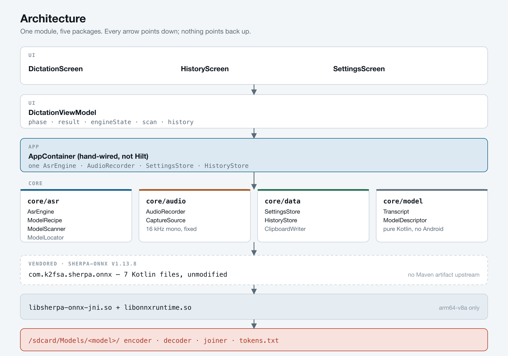
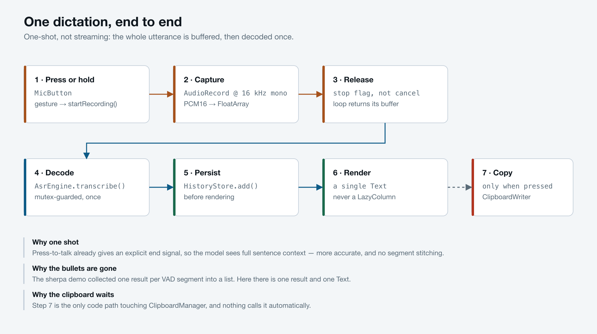
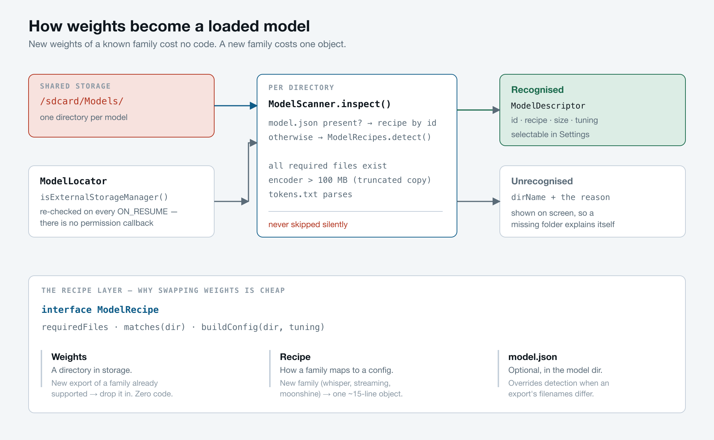
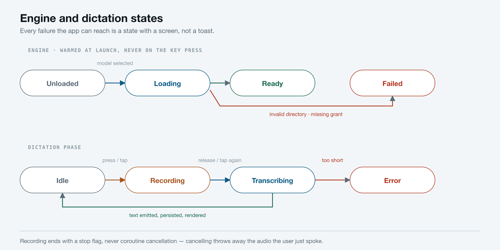

# Documentation

| Document | What it covers |
|---|---|
| [`../README.md`](../README.md) | Project overview, quick start, and every architecture decision with its trade-off |
| [`IMPLEMENTATION_PLAN.md`](IMPLEMENTATION_PLAN.md) | The plan this was built from: verified sherpa-onnx facts, phase-by-phase steps, risk ledger, and where the build deviates from the plan |

## Diagrams

Source SVGs are generated; the PNGs below are the committed artefacts. All four are
2000 px wide, drawn on a light ground so they read on either GitHub theme.

### `images/architecture.png` — the layers



One Gradle module with five packages, arranged so every dependency arrow points down.
Shows where the vendored sherpa-onnx bindings and the native `.so` files sit between
Kotlin and the weights on shared storage.

**Read it when** you are deciding where a new class belongs, or wondering what
`core/asr` is allowed to import.

---

### `images/dictation-flow.png` — one dictation, end to end



The seven steps from a finger press to text on screen, and the three design notes that
explain why the flow has this shape: one-shot decoding, no bullet list, and a clipboard
that waits to be asked.

**Read it when** you are changing anything between the microphone and the transcript.

---

### `images/model-resolution.png` — how weights become a loaded model



The scan-and-validate pipeline, plus the recipe layer that separates *weights* (a
directory, zero code) from *a model family* (one object). Includes the four validation
checks and why an unrecognised directory always states its reason.

**Read it when** you are adding support for a new model, or a folder you copied over
is not showing up.

---

### `images/state-machine.png` — engine and dictation states



Both state machines side by side. The engine warms at launch and never on the key
press; the dictation phase ends by returning to `Idle` only once the text has been
persisted and rendered.

**Read it when** you are adding a state or wondering why recording stops with a flag
rather than coroutine cancellation.

---

## Regenerating the diagrams

The PNGs are rasterised from hand-written SVG at 2×:

```bash
rsvg-convert -z 2 -b "#F3F6F8" diagram.svg -o docs/images/diagram.png
```
